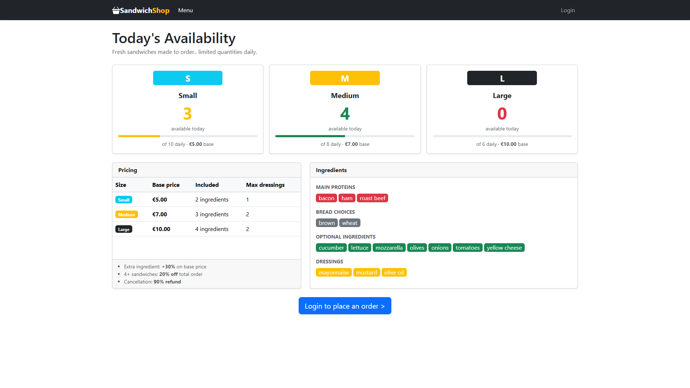
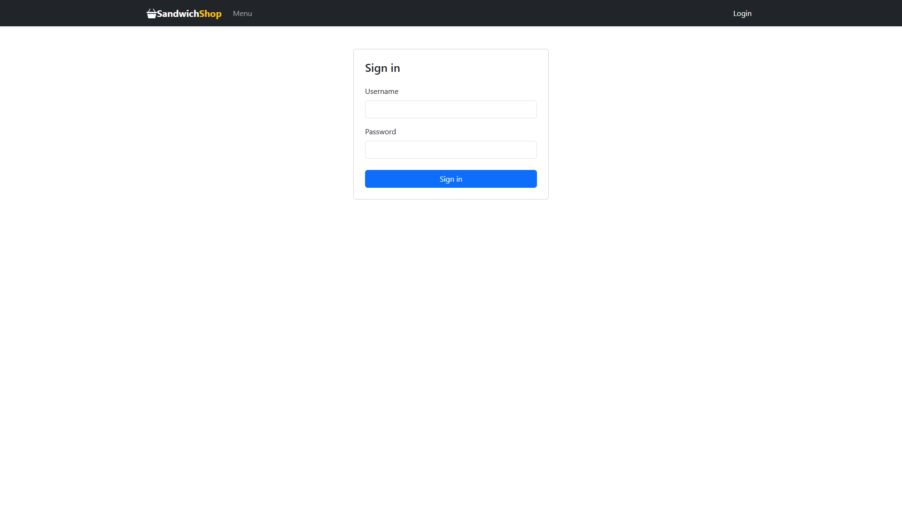
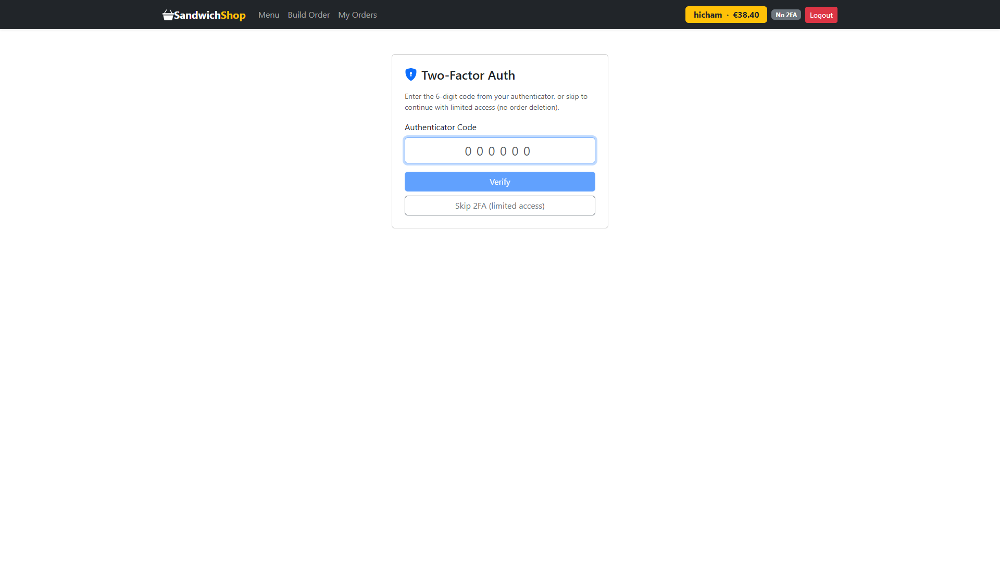
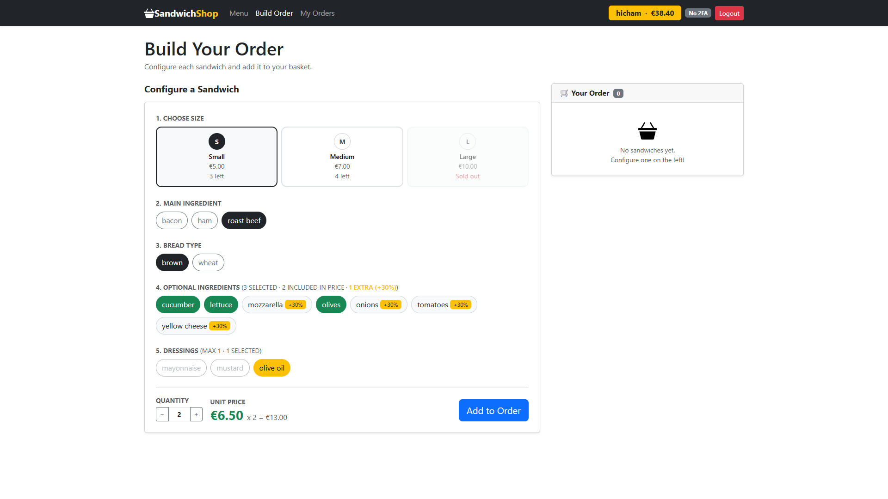
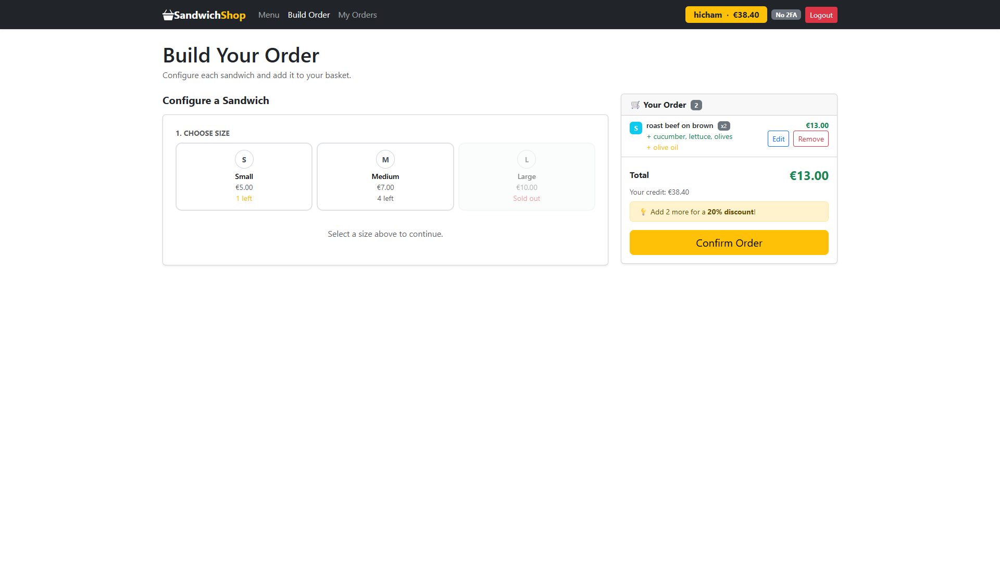
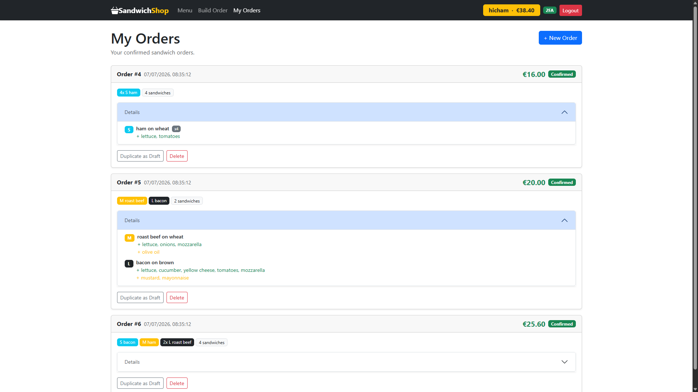
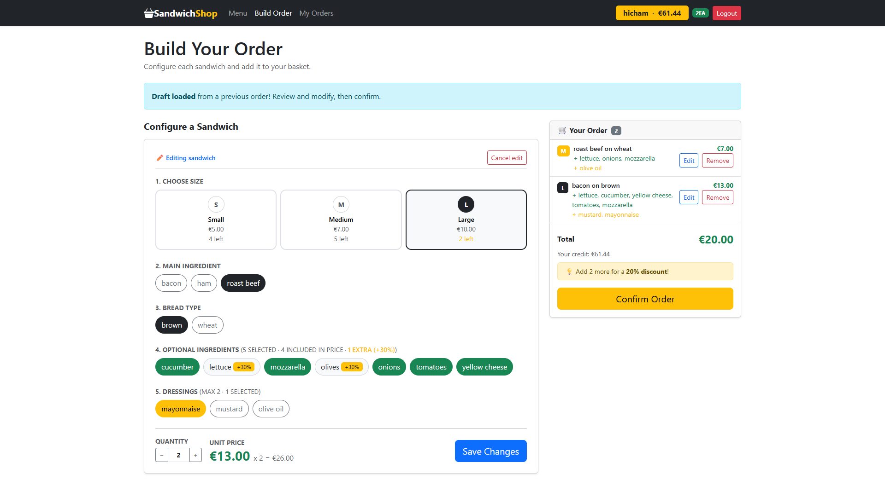

# Exam #2: "Sandwich"

## React Client Application Routes

- Route `/`: Home page, shows today's sandwich sizes with their live availability, the pricing table and the full ingredients menu. Not-logged-in users are shown a button to log in; logged-in users can navigate to build or review their orders.
- Route `/login`: Login form, allows users to authenticate with username and password and to optionally verify a TOTP code. After a successful login (with or without 2FA), the user is redirected to the main route ("/").
- Route `/order`: Protected route (requires login), lets the user configure sandwiches (size, main ingredient, bread, optional ingredients, dressings, quantity) and add them to a basket, showing running totals, discount and the user's credit, before confirming the order. Can also be reached with a pre-filled draft (e.g. when duplicating a previous order).
- Route `/orders`: Protected route (requires login), shows the list of the user's confirmed orders with their details, and lets the user delete an order (only if logged in with verified 2FA) or duplicate one as a new draft order.
- Route `*`: redirects to the home route ("/") for any non-existing URL.

## API Server

* **GET `/api/menu`**: Get the full menu, i.e. the sizes (with today's availability) and all the ingredients.
  - **Response body**: JSON object with the list of sizes and ingredients, or description of the error(s):
    ```json
    {
      "sizes": [
        {
          "id": "S",
          "label": "Small",
          "base_price": 5,
          "included_ingredients": 2,
          "max_dressings": 1,
          "daily_limit": 10,
          "confirmed_today": 7,
          "available": 3
        },
        ...
      ],
      "ingredients": [
        {
          "id": 1,
          "name": "roast beef",
          "category": "main"
        },
        ...
      ]
    }
    ```

  - Codes: `200 OK`, `500 Internal Server Error`.


* **GET `/api/availability`**: Get the current remaining availability for each size (used for real-time checks while building an order).
  - **Response body**: JSON object with the availability per size, or description of the error(s).
    ```json
    { "S": 7, "M": 4, "L": 6 }
    ```
  - Codes: `200 OK`, `500 Internal Server Error`.


* **GET `/api/orders`**: Get all the confirmed orders of the logged in user, each with its sandwiches (size, main ingredient, bread, optional ingredients and dressings).
  - **Response body**: JSON list of order objects, or description of the error(s):
    ```json
    [
      {
        "id": 1,
        "user_id": 1,
        "status": "confirmed",
        "total_price": 12,
        "created_at": "2026-07-07 08:35:12",
        "sandwiches": [
          {
            "id": 1,
            "order_id": 1,
            "size_id": "S",
            "main_ingredient_id": 2,
            "bread_id": 4,
            "quantity": 1,
            "bread": {
            "id": 4,
            "name": "wheat"
            },
            "mainIngredient": {
              "id": 2,
              "name": "ham"
            },
            "sizeInfo": {
              "id": "S",
              "label": "Small",
              ...
            },
            "optionalIngredients": [
              {
                "id": 6,
                "name": "lettuce"
              },
              ...
            ],
            "dressings": [
              ...
            ]
          },
          ...
        ]
      }
      ...
    ]
    ```
  - Codes: `200 OK`, `401 Unauthorized`, `500 Internal Server Error`.


* **POST `/api/orders`**: Submit a new order for the logged in user.
  - **Request**: JSON object with _sandwiches_, a list of sandwich configurations:
    ```json
    {
      "sandwiches": [
        {
          "sizeId": "S",
          "mainIngredientId": 2,
          "breadId": 4,
          "optionalIngredientIds": [6, 7],
          "dressingIds": [13],
          "quantity": 1
        },
        ...
      ]
    }
    ```
  - **Response body**: JSON object with the id of the newly created order, or a JSON object with error description:
    ```json
    { "orderId": 7 }
    ```
  - Codes: `201 Created`, `401 Unauthorized`, `400 Bad Request` (invalid request body, unknown size/ingredient, too many dressings), `500 Internal Server Error` (not enough availability, insufficient credit, or database error).


* **DELETE `/api/orders/:id`**: Delete a confirmed order of the logged in user, restoring the sandwiches' availability and refunding 90% of the order's price. Requires the user to be logged in **with 2FA verified**.
  - **Response body**: JSON object with the refund and the user's new credit, or a JSON object with the error:
    ```json
    { 
      "message": "Order deleted",
      "refund": 10.8,
      "newCredit": 89.2
    }
    ```
  - Codes: `200 OK`, `401 Unauthorized`, `403 Forbidden` (2FA not verified in this session), `404 Not Found` (order does not exist or does not belong to the user), `400 Bad Request` (order is not in "confirmed" status), `422 Unprocessable Entity` (invalid id), `500 Internal Server Error`.

### Authentication APIs

* **POST `/api/sessions`**: Authenticate and login the user (first factor).
  - **Request**: JSON object with _username_ and _password_:
    ```json
    { 
      "username": "musty",
      "password": "password"
    }
    ```
  - **Response body**: JSON object with the user's info, or a description of the errors:
    ```json
    {
      "id": 1,
      "username": "musty",
      "credit": 100,
      "has2FA": true,
      "totpVerified": false
    }
    ```
  - Codes: `200 OK`, `401 Unauthorized` (incorrect username and/or password), `400 Bad Request` (invalid request body), `500 Internal Server Error`.


* **POST `/api/sessions/totp`**: Perform the second factor of authentication (2FA) through a TOTP code, for the currently logged in user.
  - **Request**: JSON object with the _token_:
    ```json
    { "token": "123456" }
    ```
  - **Response body**: JSON object with the user's info, now with `totpVerified: true`, or a description of the errors.
    ```json
    {
      "id": 1,
      "username": "musty",
      "credit": 100,
      "has2FA": true,
      "totpVerified": true
    }
    ```
  - Codes: `200 OK`, `401 Unauthorized` (not logged in, or invalid/replayed code), `400 Bad Request` (user has no 2FA configured).


* **GET `/api/sessions/current`**: Get info on the logged in user.
  - **Response body**: JSON object with the same info as in login/2FA:
    ```json
    {
      "id": 1,
      "username": "musty",
      "credit": 100,
      "has2FA": true,
      "totpVerified": false
    }
    ```
  - Codes: `200 OK`, `401 Unauthorized`, `500 Internal Server Error`.


* **DELETE `/api/sessions/current`**: Logout the user.
  - **Response body**:
      ```json
      { "message": "Logged out" }
      ```
  - Codes: `200 OK`, `401 Unauthorized`.


## Database Tables

- Table `sizes`: _id_ (`S`/`M`/`L`), _label_, _base_price_, _included_ingredients_ (number of optional ingredients included in the base price), _max_dressings_, _daily_limit_, _confirmed_today_ (sandwiches of this size already ordered today).
- Table `ingredients`: _id_, _name_, _category_ (`main`, `bread`, `optional` or `dressing`).
- Table `users`: _id_, _username_, _password_hash_, _salt_, _credit_, _totp_secret_, _lastTotpStep_ (used to prevent replay of TOTP codes).
- Table `orders`: _id_, _user_id_, _status_, _total_price_, _created_at_.
- Table `order_sandwiches`: _id_, _order_id_, _size_id_, _main_ingredient_id_, _bread_id_, _quantity_. Each row is one sandwich configuration belonging to an order.
- Table `sandwich_optional_ingredients`: _sandwich_id_, _ingredient_id_. A row means the optional ingredient is part of that sandwich.
- Table `sandwich_dressings`: _sandwich_id_, _ingredient_id_. A row means the dressing is part of that sandwich.

## Main React Components

- `App` (in `App.js`): sets up the `UserProvider` context and renders the `AppNavbar` plus the `Routes`/`Route` definitions for all pages.
- `AppNavbar` (in `Navbar.js`): the top navigation bar; shows the app brand, links to Menu/Build Order/My Orders, and, when logged in, the username, credit, 2FA status badge and a logout button.
- `HomePage` (in `HomePage.js`): the home page; fetches the menu and shows an availability card per size, the pricing table and the ingredients grouped by category.
- `LoginPage` (in `LoginPage.js`): the login form; handles the two-phase login flow (username/password, then optional TOTP code) and redirects to the home page on success.
- `OrderPage` (in `OrderPage.js`): the order-building page; keeps the in-progress basket of sandwiches, re-checks availability before submitting, computes totals/discount and lets the user confirm the order.
- `SandwichConfigurator` (in `SandwichConfigurator.js`): the form used to configure a single sandwich (size, main ingredient, bread, optional ingredients, dressings, quantity), used both for adding new sandwiches and for editing an existing one in the basket.
- `OrdersPage` (in `OrdersPage.js`): the page listing the user's confirmed orders; allows deleting an order (only with verified 2FA) and duplicating an order as a new draft to prefill the `OrderPage`.

## Screenshots
















## Users Credentials

| username | password | notes |
|----------|----------|-------|
| musty    | password | Has confirmed orders |
| hicham   | password | Has confirmed orders |
| abdel    | password | No orders yet |
| jaouad   | password | No orders yet |

